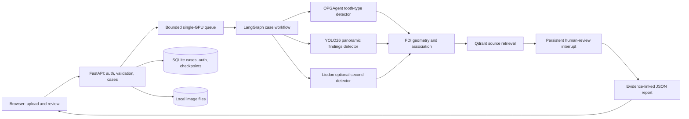

# OrthoGraph

**An evidence-linked research workbench for adult dental panoramic radiographs (OPGs).** OrthoGraph detects tooth and finding candidates, proposes FDI tooth identities, pauses for human review, and exports a structured record that connects each observation to image coordinates, model provenance, reviewer decisions, and source-linked clinical context.

[](#limitations) [](#run-locally) [](https://github.com/Mohamed-Yossri/OrthoGraph/actions/workflows/tests.yml)

**[Open the project page](https://mohamed-yossri.github.io/OrthoGraph/)** · [Launch the live app](https://7860-01m39j5g89qvbks42gqbbaybkj.cloudspaces.litng.ai/login) · [Detailed implementation notes](docs/WORKFLOW.md)

The live app runs on a Lightning Studio NVIDIA L4 endpoint that may sleep when idle. The project page is a stable, memorable entry point; it cannot keep the GPU backend awake. Allow a few minutes for a cold start and use only authorized, de-identified images.

## Architecture



The two primary vision branches analyze the **full original OPG**. Tooth identity and pathology are separate variables: a tooth may have several findings, while some findings remain regional. The app does not run a bitewing detector on a full panorama or infer a diagnosis from an LLM response.

| Layer | Implemented choice | Why |
|---|---|---|
| Interface | Responsive HTML/CSS/JavaScript served by FastAPI | Zoomable OPG, editable odontogram, crops, audit, and export in one place |
| Tooth detection | [OPGAgent](https://github.com/Zhaolin-Yu/OPGAgent) eight-class tooth-type checkpoint | Detects type 1–8; geometry supplies a provisional quadrant |
| Findings | [YOLO26 Dental Detection](https://huggingface.co/EuricoGVP/YOLO26_Dental_Detection) panoramic checkpoint | Separate nine-class candidate stream with recorded model hash |
| Optional second pass | [Liodon panoramic detector](https://huggingface.co/liodon-ai/dental-panoramic-detector) | Third-molar check; sensitivity mode also adds caries/periapical candidates at a false-alarm cost |
| Workflow | LangGraph `StateGraph` and SQLite checkpointer | Reproducible stages and a durable reviewer interrupt/resume |
| References | Qdrant local mode + BGE-small embeddings | Retrieves applicable records from four curated, source-linked summaries |
| Persistence | SQLite + local case image files | Case history, revisions, audit events, account isolation, deletion |
| Optional crop inspection | Gemini, only after a specific user request | Supplemental description; cannot accept/reject findings or replace the reviewer |

## Case pipeline

1. **Ingest.** Validate PNG/JPEG type, dimensions, size, and image integrity; normalize to PNG and strip file metadata. Uploaded orientation begins as **unknown**. The app does not automatically mirror images.
2. **Detect.** Run tooth enumeration and pathology/restoration detection on the full panorama. Run Liodon only when a third-molar candidate or sensitivity option calls for it. Weights are downloaded separately and checked against pinned SHA-256 values in [`assets.json`](research/assets.json).
3. **Resolve identity.** Combine each predicted tooth type (1–8) with image side, arch, and user-confirmed orientation. Standard display puts patient right on image left. Missing detections never shift the identities of neighboring teeth. Duplicates and uncertain assignments remain visible.
4. **Associate.** Match finding candidates to tooth regions using geometry and finding-specific rules. Preserve ambiguous or region-level findings instead of forcing an FDI label. Store detection score separately from association quality.
5. **Retrieve.** Attach applicable source records from a small Qdrant corpus. References provide context; they do not validate that a model candidate is correct.
6. **Review.** LangGraph pauses at a persistent human-review interrupt. The reviewer confirms orientation, edits FDI identities, inspects crops, reassigns findings, records notes, and accepts or rejects candidates. The workflow survives a process restart.
7. **Export.** Produce a 32-slot odontogram, findings with original-image coordinates, source model runs and hashes, reference links, typed evidence edges, review decisions, and an action trace as JSON. Undetected slots are `not_detected`, never presumed healthy or absent.

Code map: [`app.py`](app.py) exposes HTTP routes and the GPU queue; [`pipeline.py`](pipeline.py) defines the graph; [`vision.py`](vision.py) loads and runs checkpoints; [`domain.py`](domain.py) handles FDI/association/report logic; [`retrieval.py`](retrieval.py), [`storage.py`](storage.py), and [`auth.py`](auth.py) handle references, cases, and accounts. The interactive UI lives in [`static/`](static/). The [`ARCHITECTURE.md`](ARCHITECTURE.md) records checkpoint selection and design tradeoffs; parts describe earlier proposals, so the running code is authoritative.

## Run locally

Use Python 3.12 and install the CUDA PyTorch build appropriate to your machine before the remaining dependencies. The working deployment was tested on a Lightning NVIDIA L4 with PyTorch 2.8.0+cu128.

```bash
python -m pip install -r requirements.txt
python download_assets.py
python main.py
```

Open `http://localhost:7860/login`. First launch creates an ignored one-time owner credential in `data/initial-login.txt`; sign in as `mohamed-yossri` and replace that password. Other accounts can register without email. Runtime images, SQLite databases, downloaded weights, and the upstream example OPG are excluded from Git. To fetch the upstream example separately for research testing, run `python download_assets.py --demo`; its redistribution rights are not established.

The server reads `PORT` (default 7860), `ORTHOGRAPH_HOST` (default `0.0.0.0`), `ORTHOGRAPH_DATA_DIR`, and optional `GEMINI_API_KEY`. The optional cloud crop action asks for explicit consent. See the [configuration and review guide](docs/WORKFLOW.md#configuration) for limits and details.

```bash
python -m pip install -r requirements-ci.txt
python -m pytest tests -q
python verify_assets.py   # requires downloaded weights
```

GitHub Actions runs the API/domain suite without a GPU or model files. The service bounds GPU inference to one worker with a four-case queue. This is a single-instance research deployment, not a distributed clinical service.

## Measured evidence

The included [DENTEX exploratory audit](research/dentex_validation.json) ran published checkpoints on 50 validation panoramas. Its matching rules and limitations are documented [here](docs/WORKFLOW.md#exploratory-dentex-model-audit).

| Audit observation | Result |
|---|---:|
| Annotated abnormal-tooth boxes localized at IoU ≥ 0.3 | 180/182 |
| Exact FDI among localized abnormal teeth | 158/180 |
| YOLO26 caries/deep-caries site hits | 24/133 |
| Liodon caries/deep-caries site hits | 46/133, with more unmatched boxes |

A site hit means a detector-box center landed inside an annotated abnormal-tooth box. This is **not clinical sensitivity, specificity, mAP, or whole-mouth recall**. The sample is small; patient/source overlap with model training was not excluded; Liodon's checkpoint was selected using DENTEX validation. The low YOLO26 caries hit count is exposed in the app rather than concealed.

## Limitations

OrthoGraph is for research and education, **not clinical diagnosis**. It has no validated pulp-involvement, periodontal-staging, or automated bone-loss module. It does not ingest DICOM, CBCT, mixed dentition, or a hospital PHI workflow. The four-reference corpus is not full guideline ingestion; the optional Gemini generation path has schema and failure tests but no verified successful live crop generation. No prospective, external, source-disjoint clinical evaluation exists. A clinical deployment would require expert annotation rules, patient-level evaluation, safety review, data governance, and licensing review.

Upstream model terms differ: YOLO26 is labelled AGPL-3.0/research-only, Liodon CC-BY-NC-4.0, and OPGAgent model/data terms need separate review. Check those terms before redistribution or commercial use. The repo ships code and provenance, not pretrained weights.

The [continuation memory](memory.md) records the current project state for another AI or contributor.
