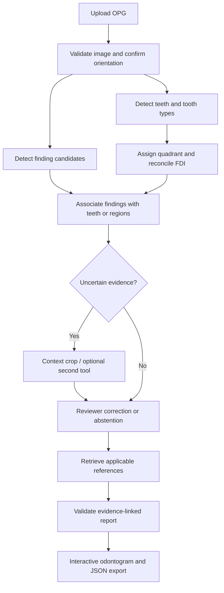

# OrthoGraph: an evidence-linked panoramic radiograph workbench

Decision, 2026-09-24: build a polished research application for permanent-dentition OPG review. Its distinguishing feature is the ability to trace a tooth-level report statement back to an image region, model output, reviewer decision, and relevant reference. Production-quality engineering is achievable; clinical readiness is not established by combining pretrained models.

This document records the original design and checkpoint audit. The implemented application is documented in README.md; the table below now describes the delivered stack.

## Assets and actual verification

Downloaded four checkpoints at immutable revisions, recorded SHA-256 hashes in `research/assets.json`, and executed each on an upstream example OPG using NVIDIA L4, PyTorch 2.8.0+cu128 and Ultralytics 8.4.161. See `research/verification/report.json`, per-model detection JSON and overlays. Measurements below are median wall time across five warm batch-one predictions, including preprocessing/postprocessing, excluding loading and saving. They are not an end-to-end service benchmark. One unlabelled example cannot establish accuracy, generalization, calibration, or comparative superiority.

| Asset | Verified role | Decision | Warm prediction |
|---|---|---|---|
| [OPGAgent enumeration](https://github.com/Zhaolin-Yu/OPGAgent/tree/466b59396fa21be0d8d2a86fd35adeabbdfde780/api_service/yolo_enumeration) | YOLO detection with 8 tooth-type classes, 1–8; **not 32 FDI classes** | Baseline tooth localizer/type classifier; combine with explicit quadrant assignment | 30.6 ms at 640 |
| [EuricoGVP/YOLO26_Dental_Detection](https://huggingface.co/EuricoGVP/YOLO26_Dental_Detection) | 9-class panoramic detector, including disease candidates and restorations | Primary research-demo findings model | 26.7 ms at 1280 |
| [liodon-ai/dental-panoramic-detector](https://huggingface.co/liodon-ai/dental-panoramic-detector) | Caries, periapical lesion, impacted tooth | Small baseline and optional impaction candidate tool | 22.0 ms at 640 |
| [gegesay89/dental-findings-yolo-detector](https://huggingface.co/gegesay89/dental-findings-yolo-detector) | 31-class segmentation checkpoint; required `dill` to load | Experimental overlay only; insufficient documented training/evaluation provenance | 24.5 ms at 640 |

YOLO26's card reports mAP50 0.919 on 2,000 held-out images, but no external validation. Its threshold was selected using that test set, so do not treat the threshold-dependent metrics as untouched test performance. Its research-only intended use is compatible with a portfolio demo. This is a provisional engineering choice, not a claim of clinical superiority.

Liodon's card reports mAP50 0.622 on only 46 validation images and merges deep caries into caries. `liodon-ai/dental-panoramic-xray-yolo` is the training-data reference; `dental-panoramic-detector/best.pt` is the actual tested model. It does not provide a separate deep-caries output.

The gegesay model has a `Bone Loss` class, but the card supplies no quantitative validation or clear standard license grant (`other`). A mask labelled bone loss is not a validated CEJ/crest/apex measurement. More classes do not establish a better detector.

[DENTEX](https://github.com/ibrahimethemhamamci/DENTEX) is valuable for evaluation and optional fine-tuning. Its reference implementation involves a heavier detection stack; the inspected tree did not provide a comparably simple bundled Ultralytics checkpoint. Do not confuse general pretrained backbones with dental-trained weights.

[PANDENT](https://huggingface.co/datasets/Desperado1103/Pandent) is a gated research dataset, not an inference checkpoint. It advertises a 500-case test benchmark and includes public-source data such as DENTEX. Check patient/source overlap before claiming independent evaluation. Access and redistribution restrictions make it unsuitable as an automatic first-run demo download.

OPGAgent already explores agentic OPG interpretation. Credit it and differentiate through editable FDI assignments, evidence provenance, explicit abstention, and measured evaluation rather than claiming novelty for tool orchestration alone.

## Concrete stack

Choose **two vision branches**, not one combined tooth/pathology label space. Tooth identity and finding type are independent: one tooth can have a filling, a root-canal filling, and a lesion candidate. Both detectors see the original full OPG at their intended input scale. Crop extraction happens afterward; feeding tooth crops into a full-panorama-trained detector introduces another distribution shift.

| Layer | Choice |
|---|---|
| Viewer/demo | Custom responsive HTML/CSS/JavaScript, with zoomable image, selectable findings, editable odontogram and evidence panel |
| Service | FastAPI; one GPU worker and bounded queue |
| Vision | OPGAgent enumeration + YOLO26 findings; optional Liodon impaction pass |
| Association | Deterministic geometry, class-aware matching and explicit uncertainty |
| Orchestration | LangGraph StateGraph, bounded conditional branches and persisted reviewer interrupts |
| References | Qdrant local mode initially; curated source records with section/page/version metadata |
| Embeddings | `BAAI/bge-small-en-v1.5`, CPU, benchmark retrieval before scaling corpus |
| Storage | SQLite metadata/audit events; local files for images and crops; UUID case IDs |
| Contracts | Pydantic report/state validation and JSON export |
| Optional VLM | Gemini API, only on explicitly requested individual crops; local VLM deferred |

The UI, orchestration, retrieval, report system and optional Gemini path are implemented. Gemini schema/error handling is tested; successful live generation remains unverified because the free endpoint returned 503.



## FDI: fix the subtle failure, not just the mirror

Standard display places patient right on image left; arbitrary exported images can already be flipped. Preserve the uploaded pixels, record orientation separately, and require orientation confirmation when reliable markers or metadata are unavailable. Do not blindly mirror every input.

Never number detected teeth simply by their rank from the midline: one missing central incisor or missed detection would shift every subsequent tooth. Use the predicted tooth type 1–8 as the second digit and quadrant as the first digit. Use arch position as a consistency check, not as the source of tooth identity.

For v1, show editable midline and arch-separation guides, with a geometry-based initial estimate. Use the dental region rather than the image center. Tilted heads and curved arches make a fixed Y split unreliable. If quadrant assignment or orientation is unresolved, emit `fdi: null` with candidate quadrants. A future 32-class FDI detector can replace this module without changing the report contract.

Enforce at most one accepted instance per FDI identity in permanent dentition. Keep competing detections in the review queue; do not silently discard all but four teeth of a type. Support missing slots without shifting numbering. Mark unobserved slots `not_detected`, not `missing` or `healthy`. Reject or explicitly mark mixed dentition unsupported in the first release.

Associate findings using overlap, distance normalized to tooth size, arch compatibility and finding-specific geometry. Periapical findings can lie outside a tooth box, so pure IoU fails. A bridge may involve multiple teeth; regional bone loss may have no single tooth association. Preserve competing candidates rather than forcing the nearest tooth. Store detector score and association quality separately; neither is a calibrated disease probability.

## Make the graph useful

Maintain a small case evidence graph with typed nodes: `Image`, `Tooth`, `Finding`, `Crop`, `ModelRun`, `ReferenceSection`, `ReviewDecision`. Edges include `observed_in`, `candidate_association`, `supported_by`, `contradicts`, and `reviewed_by`. SQLite tables or typed JSON are sufficient; Neo4j is unnecessary initially. LangGraph controls workflow, Qdrant retrieves references, and the evidence graph records provenance. These are three different functions.

Agent decisions should be inspectable: request a contextual crop, run an optional impaction detector, retrieve a relevant reference, or ask for review. Set a maximum of three crop checks per case and one retry per failing tool. Stop unresolved cases with explicit uncertainty. Independent model disagreement is useful review evidence; an LLM vote does not establish truth.

Use [LangGraph interrupts](https://docs.langchain.com/oss/python/langgraph/interrupts) for correction/review, backed by a persistent checkpointer keyed to the case. After an edit, invalidate affected associations and regenerate the report, retaining the original predictions and the edit history.

## VLM and free APIs

Do not make a VLM a launch dependency. First demonstrate the two-detector pipeline and reviewer workflow. Then test whether a VLM adds value using an ablation: detectors alone, detectors plus VLM, and reviewer-corrected output.

[Qwen2.5-VL-7B-Instruct](https://huggingface.co/Qwen/Qwen2.5-VL-7B-Instruct) is a convenient local baseline, not a validated dental specialist. Provide the full-image thumbnail plus a crop including roots and neighboring teeth; retain original coordinates. Require structured output: visible evidence, limitations, disagreement and review need. It must not invent an FDI identity, overrule accepted annotations, or convert uncertainty into a diagnosis. Cap image tokens and generated output; actual quantized VRAM and latency still need measurement.

[DentVLM](https://huggingface.co/ZJU-AI4H/DentVLM) and [OralGPT](https://huggingface.co/OralGPT/OralGPT-Omni-7B-Instruct) are dental-specific comparison candidates, but both present access gates. Their availability and task-specific performance must be tested before replacing the baseline.

Gemini can optionally phrase a report from reviewed structured evidence and retrieved reference text. The offline report template remains available when a free-tier quota is exhausted. Do not assume a particular API model or quota from the existence of a secret; [limits depend on project/model/tier](https://ai.google.dev/gemini-api/docs/rate-limits). The optional Gemini integration was later tested with synthetic inputs; live generation was unavailable during that check. Never place API credentials in source or logs.

## References and clinical scope

Start with a small, versioned corpus rather than indiscriminate web scraping. Each chunk needs publisher, document title, date/version, source URL, section/page, text hash and allowed use. Retrieve by finding type and question, then filter for applicability. Every recommendation must point to an actual retrieved passage; if none applies, say so. Test citation support separately from JSON validity. [Qdrant local mode](https://qdrant.tech/documentation/quickstart/) avoids a separate database service for the demo.

The first report distinguishes radiographic candidates, reviewer-accepted observations and questions requiring clinical information. It does not autonomously prescribe treatment.

- Caries: report suspected radiographic findings; do not claim absence of decay after a negative OPG detector result. ADA's classification/risk framework incorporates clinical findings and history; it is not a label lookup from a box. [ADA reference](https://www.ada.org/resources/ada-library/oral-health-topics/caries-risk-assessment-and-management).
- Pulp: remove automatic pulpitis/necrosis and definitive pulp-involvement claims. Radiographs are one component of assessment alongside clinical history/examination and pulp testing. [AAE reference](https://www.aae.org/specialty/save-a-tooth-maybe-save-a-life/).
- Periodontium: defer automatic staging/grading. Radiographic bone loss can contribute to staging, but stage/grade needs additional severity, complexity and clinical information. A later measurement module needs validated CEJ, crest and apex localization, surface selection and uncertainty. Generic MedSAM masks do not supply these anatomical landmarks. [EFP consensus](https://www.efp.org/fileadmin/uploads/efp/Documents/Campaigns/New_Classification/Reports/Consensus_report__Workgroup_2__Papapanou_et_al-2018-Journal_of_Clinical_Periodontology.pdf).
- Preserve label meanings: wisdom tooth is not synonymous with impaction; a restoration is not decay; model non-detection is not confirmed absence.

License status is a release constraint: Liodon is labelled CC-BY-NC-4.0; YOLO26 AGPL-3.0; gegesay `other`; OPGAgent's root license and enumeration README differ, and upstream model/data terms also need checking. Use these assets for the research prototype, with attribution and a separate rights review before redistribution or commercial use. Do not infer weight rights solely from a repository's code license.

## Report contract and UI

Proposed report shape (illustrative, not a prediction):

```json
{
  "schema_version": "1.0",
  "case_id": "uuid",
  "status": "awaiting_review",
  "orientation": {"patient_right": "image_left", "confirmed": false},
  "odontogram": {"11": {"status": "not_detected", "finding_ids": []}},
  "findings": [{
    "id": "finding-1",
    "label": "suspected_caries",
    "fdi": null,
    "candidate_fdi": [],
    "bbox_xyxy": [100, 200, 160, 270],
    "coordinate_space": "original_image_pixels",
    "detector_score": 0.62,
    "review_status": "unreviewed",
    "model_run_id": "run-1",
    "evidence_ids": ["crop-1"],
    "reference_ids": []
  }],
  "limitations": ["Illustrative schema only"],
  "recommendations": [],
  "audit_events": []
}
```

The real odontogram initializes all 32 FDI slots. Preserve raw source labels alongside normalized application labels. Record model revision/hash, input hash, preprocessing transform, timestamps and tool status. Unsupported assessments are explicit, never filled with guessed normal values.

The impressive demo moment: select a tooth in the odontogram, highlight its exact image region, inspect the original crop, review model disagreements, correct the assignment, and see only the affected report statements update with source links. Show restorations and anatomy with distinct visual styling from disease candidates. Display a short action trace, not hidden chain-of-thought. Export machine-readable JSON and a readable report.

## Build and evaluation order

1. Ship the local viewer, two tested models, editable FDI assignment, association and JSON export. Use properly authorized demo images; the upstream smoke-test sample's presence in a public repository is not proof of redistribution rights.
2. Add persistent LangGraph review and the evidence graph. Verify orientation ambiguity, absent teeth, duplicate labels, tilted arches, region-level findings and empty detections.
3. Add the curated retrieval corpus and citation-linked explanations. Use deterministic templates first, optional text generation second.
4. Evaluate on a frozen, source-disjoint labelled set. Keep threshold tuning and final testing separate. Report per-class sensitivity/precision, false positives per image, tooth localization, exact FDI accuracy, finding-to-tooth association, abstention/coverage and unsupported report claims. Also measure end-to-end p50/p95 latency, VRAM, timeout recovery and reviewer correction burden.
5. Add VLM crop review only if it improves a prespecified metric without unacceptable false positives or latency. Add bone-loss measurement only after landmark validation.

No new training is required for the first demo. If FDI assignment remains the main measured failure, a small 32-class YOLO fine-tune on authorized enumeration data is a justified second phase; repeated prompt engineering will not repair a weak tooth-identity model.

Before a public service, add authenticated case access, bounded uploads, retention/deletion controls, durable jobs and isolated GPU workers. Clinical deployment additionally requires external/prospective evaluation and an appropriate clinical/regulatory process. Neither a sophisticated UI nor RAG supplies that evidence.

## Reproduce the work completed here

From the Studio root:

```bash
python -m pip install -r orthograph/requirements-verification.txt
python orthograph/verify_assets.py
```

Weights are already downloaded in `orthograph/weights/`. Their pinned URLs and hashes are in `research/assets.json`. Running the script needs GPU access outside the restricted agent sandbox; it also supports CPU when CUDA is unavailable. To repeat one model only, use `--models gegesay` (or another manifest model name).

Installed Ultralytics and dill in the existing Lightning environment because Lightning disallows additional virtual environments. The application was subsequently built and launched; see the repository README for current runtime and tests.
